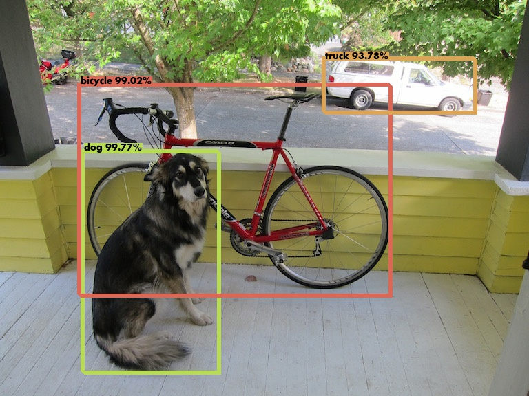

# object-detection-api-server
object detection api 서버 프로젝트.  
사진을 올리면 디텍션 결과를 json형태로 반환.  
YOLOv3와 Flask로 구성되어 있습니다.  
기존 클론한 프로젝트(https://github.com/theAIGuysCode/Object-Detection-API) 에서 사진을 전송 하지 않고, 사진파일의 url만 전송하여 detection 하는 기능을 추가 하고, 몇가지 edge case를 다듬었습니다.

<br/>

## 1. Install
### Conda
가급적이면 conda환경을 구성해서 하는걸 추천합니다.
```shell
# Tensorflow CPU
conda env create -f conda-cpu.yml
conda activate yolov3-cpu

# Tensorflow GPU
conda env create -f conda-gpu.yml
conda activate yolov3-gpu

# For apple silicon mac
conda env create -f conda-gpu-mac.yml
conda activate yolov3-gpu
```
apple silicon 맥으로 하려면, [여기](https://developer.apple.com/metal/tensorflow-plugin/)
를 참고해서 miniforge를 설치하고 위의 명령어를 수행합니다.

### Weights
가중치 파일은 일단은 coco dataset 으로 미리 학습된 모델을 받습니다.  
두번째는 제가 학습시킨 모델입니다. 각자 darknet을 이용하여 학습한 모델을 사용할 수 있습니다.
```shell
# pretrained weights
wget https://pjreddie.com/media/files/yolov3.weights -O weights/yolov3.weights

# custom weights (for food detection)
wget https://github.com/Qone2/object-detection-api-server/releases/download/v1.0.0/yolov3-food_6000.weights
```

### Custom model
커스텀 모델을 사용하려면 3가지 사항이 필요합니다.
1. custom weights file
2. 라벨파일 (./data/labels/***.names)
3. app.py에 파라미터 변환
    * classes_path 값이 적절한 .names파일 주소로 되어있어야합니다.
    * num_classes 값이 트레인된 모델의 클래스값과 같아야합니다.


### Convert
가중치 파일을 텐서플로 모델로 변환하여 저장합니다.
```shell
python load_weights.py

# for custom weights
python load_seights.py --weights ./weights/yolov3-custom.weights --num_classes 1
```

### Run
flask 서버 실행 (Development 단계).
```shell
python app.py
```

waitress 서버 실행 (Production 단계).
```shell
python waitress-server.py
```
참고로 apple silicon mac에서는 app.py를 통해서는 정상실행되지 않고 waitress-server로 실행해야 합니다.

<br/>

## 2. Usage
### Detections by url list (POST http://localhost:5000/detections/by-url-list)
이미지 url 리스트를 json 형태로 body 에 담아 요청하면 detection 결과를 json 형태로 반환합니다.

요청 예시:
```json
{
    "images" : [
        "https://images.unsplash.com/photo-1627662055794-94ab33f5913a",
        "https://images.unsplash.com/photo-1622495506073-56b1152a010c"
        ]
}
```

응답 예시:
```json
{
    "response": [
        {
            "image": "Image1",
            "detections": [
                {
                    "class": "diningtable",
                    "confidence": 99.8,
                    "box": [
                        0.12132644653320312,
                        0.5485565066337585,
                        1.0,
                        1.0
                    ]
                },
                {
                    "class": "person",
                    "confidence": 99.71,
                    "box": [
                        0.5034169554710388,
                        0.11528550088405609,
                        0.7645244002342224,
                        0.6085698008537292
                    ]
                },
                {
                    "class": "bowl",
                    "confidence": 99.23,
                    "box": [
                        0.44472020864486694,
                        0.8059434294700623,
                        0.5776651501655579,
                        0.9304993748664856
                    ]
                },
                {
                    "class": "person",
                    "confidence": 98.21,
                    "box": [
                        0.012484341859817505,
                        0.41216278076171875,
                        0.31197530031204224,
                        0.9309743642807007
                    ]
                },
                {
                    "class": "bowl",
                    "confidence": 98.17,
                    "box": [
                        0.6474762558937073,
                        0.7368081212043762,
                        0.826253354549408,
                        0.863882839679718
                    ]
                },
                {
                    "class": "bowl",
                    "confidence": 97.21,
                    "box": [
                        0.18658582866191864,
                        0.6121846437454224,
                        0.28002217411994934,
                        0.7035609483718872
                    ]
                },
                {
                    "class": "cup",
                    "confidence": 97.2,
                    "box": [
                        0.6687061190605164,
                        0.5676307082176208,
                        0.7223262190818787,
                        0.7238855957984924
                    ]
                },
                {
                    "class": "bottle",
                    "confidence": 93.96,
                    "box": [
                        0.3495180010795593,
                        0.39886903762817383,
                        0.40634453296661377,
                        0.6639630794525146
                    ]
                },
                {
                    "class": "person",
                    "confidence": 82.74,
                    "box": [
                        0.8712364435195923,
                        0.24241915345191956,
                        0.9962763786315918,
                        0.7965537309646606
                    ]
                },
                {
                    "class": "bottle",
                    "confidence": 81.39,
                    "box": [
                        0.5871250629425049,
                        0.4325503706932068,
                        0.6490375995635986,
                        0.678182065486908
                    ]
                },
                {
                    "class": "cup",
                    "confidence": 81.04,
                    "box": [
                        0.39027926325798035,
                        0.5910888910293579,
                        0.4418056309223175,
                        0.7453434467315674
                    ]
                },
                {
                    "class": "bowl",
                    "confidence": 80.9,
                    "box": [
                        0.7159096002578735,
                        0.6054959297180176,
                        0.7882776260375977,
                        0.692406415939331
                    ]
                },
                {
                    "class": "fork",
                    "confidence": 66.51,
                    "box": [
                        0.22019794583320618,
                        0.735252857208252,
                        0.34174033999443054,
                        0.8157186508178711
                    ]
                },
                {
                    "class": "bottle",
                    "confidence": 60.97,
                    "box": [
                        0.451582670211792,
                        0.44237056374549866,
                        0.5153754949569702,
                        0.6514608860015869
                    ]
                },
                {
                    "class": "bottle",
                    "confidence": 59.96,
                    "box": [
                        0.28215375542640686,
                        0.43681180477142334,
                        0.34776386618614197,
                        0.672755241394043
                    ]
                },
                {
                    "class": "vase",
                    "confidence": 50.08,
                    "box": [
                        0.28215375542640686,
                        0.43681180477142334,
                        0.34776386618614197,
                        0.672755241394043
                    ]
                }
            ]
        },
        {
            "image": "Image2",
            "detections": [
                {
                    "class": "person",
                    "confidence": 99.95,
                    "box": [
                        0.5193047523498535,
                        0.3304807245731354,
                        0.7335317134857178,
                        1.0
                    ]
                },
                {
                    "class": "person",
                    "confidence": 99.93,
                    "box": [
                        0.24700728058815002,
                        0.37773293256759644,
                        0.4714524447917938,
                        0.9851582646369934
                    ]
                },
                {
                    "class": "car",
                    "confidence": 98.42,
                    "box": [
                        0.7070157527923584,
                        0.4971548616886139,
                        1.0,
                        0.7645412683486938
                    ]
                },
                {
                    "class": "car",
                    "confidence": 92.53,
                    "box": [
                        0.5153974294662476,
                        0.5777716040611267,
                        0.5334419012069702,
                        0.6002735495567322
                    ]
                },
                {
                    "class": "bottle",
                    "confidence": 87.44,
                    "box": [
                        0.39980244636535645,
                        0.745155930519104,
                        0.4384307861328125,
                        0.858757495880127
                    ]
                },
                {
                    "class": "car",
                    "confidence": 77.97,
                    "box": [
                        0.5002050399780273,
                        0.5781807899475098,
                        0.5160926580429077,
                        0.5968194007873535
                    ]
                },
                {
                    "class": "bottle",
                    "confidence": 71.37,
                    "box": [
                        0.5644744634628296,
                        0.6902166604995728,
                        0.594266414642334,
                        0.7935333251953125
                    ]
                },
                {
                    "class": "car",
                    "confidence": 70.21,
                    "box": [
                        0.4521511495113373,
                        0.5697953701019287,
                        0.49378278851509094,
                        0.6160407066345215
                    ]
                }
            ]
        }
    ]
}
```
url 의 image 포맷이 jpg나 png 이어야 합니다. 

<br/>

### Detections by image files (POST http://localhost:5000/detections/by-image-files)
1개 이상의 이미지 파일을 multipart/form-data 형식으로 body에 담아서 보내야 합니다.  
key 값은 "images"로 주어야 합니다.

postman 서비스를 이용하면 요청을 테스트 하기도 쉽고, 각 언어에 맞는 코드로 알려주기도 합니다.

요청 예시 (python.requests):
```python
import requests

url = "http://127.0.0.1:5000/detections"

payload={}
files=[
  ('images',('dog.jpg',open('/C:/Users/Qone/real-matzip-backend-detection-api-server/data/images/dog.jpg','rb'),'image/jpeg')),
  ('images',('meme.jpg',open('/C:/Users/Qone/real-matzip-backend-detection-api-server/data/images/meme.jpg','rb'),'image/jpeg'))
]
headers = {}

response = requests.request("POST", url, headers=headers, data=payload, files=files)

print(response.text)
```
응답 예시:
```json
{
    "response": [
        {
            "image": "dog.jpg",
            "detections": [
                {
                    "class": "dog",
                    "confidence": 99.77,
                    "box": [
                        0.1592036783695221,
                        0.38621821999549866,
                        0.41723302006721497,
                        0.9451944828033447
                    ]
                },
                {
                    "class": "bicycle",
                    "confidence": 99.02,
                    "box": [
                        0.15322661399841309,
                        0.21770429611206055,
                        0.7412543296813965,
                        0.75117427110672
                    ]
                },
                {
                    "class": "truck",
                    "confidence": 93.78,
                    "box": [
                        0.6156051754951477,
                        0.15119574964046478,
                        0.9018890261650085,
                        0.2891038656234741
                    ]
                }
            ]
        },
        {
            "image": "meme.jpg",
            "detections": [
                {
                    "class": "cup",
                    "confidence": 99.81,
                    "box": [
                        0.1426621973514557,
                        0.5277761220932007,
                        0.2718425393104553,
                        0.6574826240539551
                    ]
                },
                {
                    "class": "person",
                    "confidence": 99.77,
                    "box": [
                        0.28982922434806824,
                        0.09854650497436523,
                        0.9584647417068481,
                        0.9202167987823486
                    ]
                },
                {
                    "class": "laptop",
                    "confidence": 98.46,
                    "box": [
                        0.0,
                        0.39493703842163086,
                        0.5229729413986206,
                        0.7962775230407715
                    ]
                },
                {
                    "class": "apple",
                    "confidence": 90.83,
                    "box": [
                        0.13114461302757263,
                        0.7714358568191528,
                        0.22893354296684265,
                        0.9072953462600708
                    ]
                },
                {
                    "class": "chair",
                    "confidence": 77.85,
                    "box": [
                        0.2950730621814728,
                        0.3067718744277954,
                        0.999886155128479,
                        0.9955943822860718
                    ]
                },
                {
                    "class": "cell phone",
                    "confidence": 73.47,
                    "box": [
                        0.18850097060203552,
                        0.8756942749023438,
                        0.3350185453891754,
                        0.9422210454940796
                    ]
                },
                {
                    "class": "clock",
                    "confidence": 67.04,
                    "box": [
                        0.4010809361934662,
                        0.21244612336158752,
                        0.49267420172691345,
                        0.35021504759788513
                    ]
                }
            ]
        }
    ]
}
```
<br/>

### Image by image file (POST http://localhost:5000/image/by-image-file)
1개의 이미지파일을 multipart/form-data 형식으로 body에 담아서 보내야합니다.  
key 값은 "images"로 주어야 합니다.

postman 서비스를 이용하면 요청을 테스트 하기도 쉽고, 각 언어에 맞는 코드로 알려주기도 합니다.

요청 예시(node.js axios):
```javascript
var axios = require('axios');
var FormData = require('form-data');
var fs = require('fs');
var data = new FormData();
data.append('images', fs.createReadStream('/C:/Users/Qone/Downloads/real-matzip-backend-detection-api-server/data/images/dog.jpg'));

var config = {
  method: 'post',
  url: 'http://localhost:5000/image',
  headers: { 
    ...data.getHeaders()
  },
  data : data
};

axios(config)
.then(function (response) {
  console.log(JSON.stringify(response.data));
})
.catch(function (error) {
  console.log(error);
});
```

응답 예시:<br/>


<br/>

## TODO
* [x] Custom weights 적용
* [ ] YOLOv4 적용
* [ ] v4 용 custom weight 적용

<br/>

## Reference
여기에서 모델을 학습 할 수 있습니다.
* https://github.com/AlexeyAB/darknet
* https://pjreddie.com/darknet/yolo/

이곳에서 영향을 많이 받았고, 필요에 맞게 수정하였습니다.
* https://github.com/theAIGuysCode/Object-Detection-API
